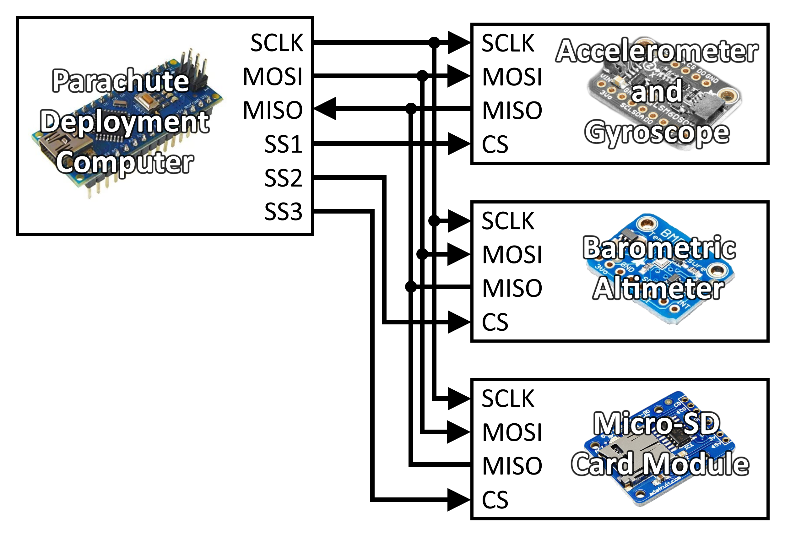
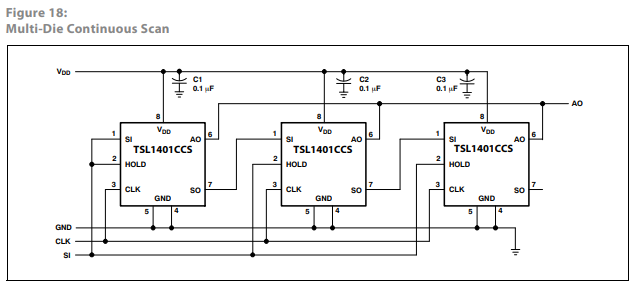
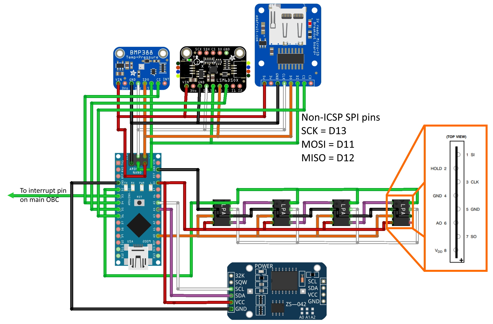

# Parachute Deployment Computer System Requirements Specification

#### TODO 
- Additional functional requirement additions
- More detail in specific requirments (e.g. configuration parameters for
components, such as g range for accelerometer etc.)
- Consider moving out of mark down for easier renaming of numbers when
order changes (and other functionalities)
- More images

---
## 1. Introduction
### 1.1. Purpose 
The <i>SunSat</I> (<b>S</b>heffield <b>U</b>niversity <b>N</b>ova 
<b>SAT</b>ellite) project is a student-run project that aims to design and 
build a cubesat to launch aboard a <i>SunrIde</i> (<b>S</b>heffield 
<b>U</b>niversity <b>N</b>ova <b>R</b>ocket <b>I</b>nnovative <b>D</b>esign 
<b>E</b>ngineering) sounding rocket in the 
<a href="https://spaceportamericacup.com/">Spaceport America Cup</a> in
the summer of 2021. 

One subsystem of the Nova satellite platform is the parachute deployment
computer and its associated peripherals. This document outlines the
specific requirements of this system.

The purpose of this document is to outline the specifications of the 
parachute deployment and attitude determination subsystem, which will allow
for easier design and verification further down the line.

This document is intended for internal use of the <i>SunSat</i> development
team as a reference throughout the project.

<b>Note:</b> This document will be relatively light due to the timescale
and scope of this section of the entire system.

### 1.2. Scope
The parachute deployment and attitude determination subsystem will perform:
#### 1.2.1. Apogee Detection
Whilst this iteration uses passive parachute deployment, it is sensible to 
now test apogee detection methods for future iterations which may use active 
deployment.
Apogee detection will be via 3 separate sensors:
- A barometric altimeter will detect when the measured pressure stops decreasing, and begins increasing. 
- Light sensors will detect an increase in ambient light levels once the payload is exposed to the atomosphere (expected at apogee). 
- An accelerometer will be used to measure the accelerations on the vehicle
- The altimeter and accelerometer will together estimate velocity via a Kalman Filter to mitigate uncertainties in the estimates
    
#### 1.2.2. Attitude Determination 
Attitude Determination and Control Systems (ADCS) are important in any 
satellite, and whilst this iteration of Nova is suborbital, early testing of 
ADCS will improve the teams understanding of them and give adequate time to 
review and modify the systems on the way to an orbital flight. Space is 
competetive and so proving that the concept works now is a leg-up in proving 
the whole platform later.

After apogee detection, the PDC is free to perform other functions, and so it can support ADCS activites. This reduces system complexity.

Attitude determination will use:
- Gyrospcope to measure rotation rates and infer orientation. The readings will
be filtered to reduce the impact of noise and drift

### 1.3. Definitions and Acronyms
<b>Nova</b> | The satellite platform

<b>VESNA</b> | The sounding rocket

<b>OBC</b> | <b>O</b>n-<b>b</b>oard <b>C</B>omputer

<b>PDC</b> | <b>P</b>arachute <b>D</b>eployment <b>C</b>omputer 

---

## 2. Overview of Document
The next chapter - the Overall Description section of this document - describes
a higher level perspective of the system functionality. It describes the 
requirements in a more general sense and develops a context for the later
technical requirements specifications.

The third chapter - the Requirements Specification section of this document - 
is written primarily for the developers and provides a lower level description
of the more specific requirements of the PDC subsystem.

Both sections of the document describe the same software product in its 
entirety, but are intended for different audiences and thus use different 
language.

---
## 3. Overall Description

### 3.1. Subsystem Perspective
The susbsystem will be centered around the PDC, which is an <b>Arduino Nano
board</b> running on software that has been developed in the Arduino programming
environment. The board will have hardware interfaces to a series of sensors
that will help it perform its apogee detection and attitude determination
tasks.

The sensors that contribute to the subsystem are:
- A <b>digital barometric altimeter</b>, that measures the pressure 
and temperature of the surrounding air. These values can be compensated and
used to calculate the current altitude. The altitude measurements will be
fed into the apogee detection kalman filter to contribute to the upward velocity
estimates.
- A <b>MEMS accelerometer</b>. The acceleration output measurements can also be 
fed through the kalman filter to help estimate velocity, and the point at 
which the velocity is equal to zero will be the estimated point of apogee.
- A <b>set of light sensors</b>. During the apogee detection stage, they will measure the amount of incident
light - this will allow them to recognise when the Nova satellite has been
exposed to the atmosphere by the VESNA rocket (this would occur at apogee,
ideally). 
- A <b>3-axis MEMS gyroscope</b>, contained within the same package as the 
above mentioned accelerometer, for simplicity. Ideally, the gyroscope output
could be part of a set of measurements in an extended kalman filter with
another sensor, but this would be too complex computationally for the given
resources at this stage, and so the gyroscope readings are used to estimate
the current orientation of the vehicle by means of some data filtering to
account for noise, bias, and drift in the reading.

The PDC will need to be able to appropriately configure and communicate with 
each of these sensors, as well as the main OBC. It would also be beneficial to 
store all of the collected data (e.g. acceleration values, light levels, etc.)
to an external storage device that can be easily read at the end of the mission
for analysis. An <b>SD Card</b> is therefore also a part of this system which 
can accept data from the PDC at specified points in time. This will allow for
post-flight analysis to check the performance of the subsystem. At the same time,
real-time telemetry can be made available by communicating with the main OBC
at a lower rate than used to write to the SD card. The OBC will route this data
to the comms subsystem and relay it to the ground station.

### 3.2. Subsystem Functions
This subsystem should be able to accurately detect the point of apogee and 
use this information to move into an appropriate subroutine. In the case of
an active deployment this would involve the release of a parachute at a 
pre-determined time or event after apogee. In the case of a passive deployment
the goal is simply to make this detection and record the time at which it
occurs.

Once the parachute has unfurled, the vehicle will register some decleration
from free-fall velocity, and this will confirm successful deployment of the
parachute. If for some reason the parachute has not successfully deployed, 
the Nova platform should be able to detect this and repeat the command to
deploy the parachute.

After the parachute deployment sequence is detected as complete, the PDC can
proceed into it's second function of attitude determination. This will involve
using filtered sensor outputs to estimate the attitude of the Nova platform
relative to some fixed reference frame. Expanding this to future iterations,
knowing the attitude of the vehicle at any given time would benefit an
attitude control system by allowing for fine pointing control of the vehicle. 

### 3.3. Assumptions and Dependencies
The flight time should be estimated and an appropriate data-logging rate
determined in order to select an adequate amount of storage on the SD card.

It is assumed that the dynamics during launch and during parachute can
be simplified sufficiently in order to implement the digital Kalman Filters.
This includes the assumption that the flight will be 'straight up' and that
the thrust on the vehicle isn't important (as we care much more about accuracy
during the coast phase than the propelled phase).

---

## 4. System Features and Requirements

### 4.1. External Interface Requirements
#### Hardware Interfaces  
<b>Note:</b> Diagrams do not show connections to power or ground lines for simplicity

The Arduino Nano is equipped with SPI communications interfaces. This is to 
be used to interface with the SD card module, the MEMS
accelerometer/gyroscope package, and the barometric altimeter. A diagram
of this series of connections is provided below.

	

The Arduino Nano board also has an I2C interface which can be used by the 
real-time clock unit. The connection is shown in the below diagram.

	

The linear photodiode array circuits are identical and don't have slave select pins. They simply need
a serial input to go high which causes them to make a new measurement, and a clock signal for synchronisation.
These can be provided by GPIO pins on the PDC, and the four arrays can be cascaded to provide their output
to a single pin on the PDC, as shown below (figure from TSL1401-CCS datasheet)

	

An interrupt will be sent from the PDC to the main OBC to inform it that 
apogee has been detected, and to send the OBC into an appropriate interrupt
handling routine for this event. This can simply be done by connecting one
of the PDC GPIO pins to an interrupt pin on the main OBC.

These three connection types can then be summarised in the overall connection
diagram as below.

	

### 4.2. Functional Requirements
This section includes the requirements that specify all the fundamental
actions of the system. 

<b>Note:</b> Due to time restrictions and classification of this project,
the requirements are relatively informal and brief.

### 4.2.1. Class 1 -  Initialisation
#### Functional Requirement 1.1
<b>ID:</b> FR1\
<b>TITLE:</b> Initialise SPI Bus\
<b>DESC:</b> On startup, the PDC should initialise its SPI bus in order
to allow communications with external devices\
<b>RAT:</b> To facilitate communications via SPI\
<b>DEP:</b> None

#### Functional Requirement 1.2
<b>ID:</b> FR2\
<b>TITLE:</b> Initialise I2C Bus\
<b>DESC:</b> On startup, the PDC should initialise its I2C bus in order
to allow communications with external devices\
<b>RAT:</b> To facilitate communications via I2C\
<b>DEP:</b> None

#### Functional Requirement 1.3
<b>ID:</b> FR3\
<b>TITLE:</b> Configure Approppriate GPIO Pins\
<b>DESC:</b> On startup, the PDC should configure the appropriate GPIO
pins that it will use to communicate with external devices\
<b>RAT:</b> To facilitate communications with external devices\
<b>DEP:</b> None

#### Functional Requirement 1.4
<b>ID:</b> FR4\
<b>TITLE:</b> kalman filter setup?\
<b>DESC:</b> initialise kalman filter with current values?\
<b>RAT:</b> to provide initial conditions and model preps\
<b>DEP:</b> 

#### Functional Requirement 1.5
<b>ID:</b> FR5\
<b>TITLE:</b> Verify SPI Bus\
<b>DESC:</b> On startup, the PDC should read the "WHO_AM_I" (or similar
identification) register of each connected device in order to verify that
the SPI bus has been correctly setup, and is now able to communicate with
the PDC via SPI. [Micro SD might use SD.begin(CS pin for card)]\
<b>RAT:</b> To verify that the PDC can communicate with external devices
on the SPI bus\
<b>DEP:</b> FR1

#### Functional Requirement 1.6
<b>ID:</b> FR6\
<b>TITLE:</b> Configure Accelerometer/Gyroscope Unit\
<b>DESC:</b> Having verified that the PDC can communicate with the 
accelerometer/gyroscope via SPI (as per FR5), the unit should be configured
appropriately\
<b>RAT:</b> To appropriately configure the accelerometer/gyroscope for this
application\
<b>DEP:</b> FR1, FR5

#### Functional Requirement 1.7
<b>ID:</b> FR7\
<b>TITLE:</b> Configure Altimeter Unit\
<b>DESC:</b> Having verified that the PDC can communicate with the 
altimeter via SPI (as per FR5), the unit should be configured appropriately\
<b>RAT:</b> To appropriately configure the altimeter for this application\
<b>DEP:</b> FR1, FR5

#### Functional Requirement 1.8
<b>ID:</b> FR8\
<b>TITLE:</b> Write Column Headings to Micro-SD Card\
<b>DESC:</b> Having verified that the micro-SD card is connected and can be
reached via SPI, the columns of the .csv file that data will be stored in
should be writted to the card in preparation for data input.\
<b>RAT:</b> To provide column headers for the .csv data-log for readability
purposes\
<b>DEP:</b> FR1, FR5

### 4.2.2. Class 2 - Parachute Deployment
#### 4.2.2.1. Functional Requirement 2.1 
<b>ID:</b> FRx\
<b>TITLE:</b> \
<b>DESC:</b> \
<b>RAT:</b> \
<b>DEP:</b> \

#### 4.2.2.n. Functional Requirement 2.n
<b>ID:</b> FRn\
<b>TITLE:</b> \
<b>DESC:</b> \
<b>RAT:</b> \
<b>DEP:</b> \

### 4.2.3. Class 3 - Attitude Determination
#### Functional Requirement 3.1 

### Nonfunctional Requirements