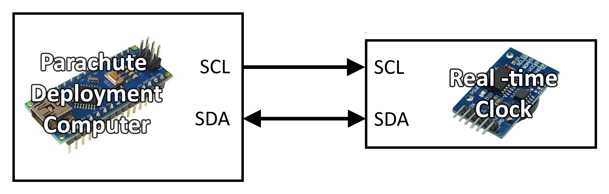

# Parachute Deployment Computer System Requirements Specification

#### TODO 
- Additional functional requirement additions
- More detail in specific requirments (e.g. configuration parameters for
components, such as g range for accelerometer etc.)
- Consider moving out of mark down for easier renaming of numbers when
order changes (and other functionalities)
- More images

---
## 1. Introduction
### 1.1. Purpose 
The <i>SunSat</I> (<b>S</b>heffield <b>U</b>niversity <b>N</b>ova 
<b>SAT</b>ellite) project is a student-run project that aims to design and 
build a cubesat to launch aboard a <i>SunrIde</i> (<b>S</b>heffield 
<b>U</b>niversity <b>N</b>ova <b>R</b>ocket <b>I</b>nnovative <b>D</b>esign 
<b>E</b>ngineering) sounding rocket in the 
<a href="https://spaceportamericacup.com/">Spaceport America Cup</a> in
the summer of 2021. 

One subsystem of the Nova satellite platform is the parachute deployment
computer and its associated peripherals. This document outlines the
specific requirements of this system.

The purpose of this document is to outline the specifications of the 
parachute deployment and attitude determination subsystem, which will allow
for easier design and verification further down the line.

This document is intended for internal use of the <i>SunSat</i> development
team as a reference throughout the project.

<b>Note:</b> This document will be relatively light due to the timescale
and scope of this section of the entire system.

### 1.2. Scope
The parachute deployment and attitude determination subsystem will perform:
#### 1.2.1. Apogee Detection
Whilst this iteration uses passive parachute deployment, it is sensible to 
now test apogee detection methods for future iterations which may use active 
deployment.
Apogee detection will be via 3 separate sensors:
- A barometric altimeter will detect when the measured pressure stops decreasing, and begins increasing. 
- Light sensors will detect an increase in ambient light levels once the payload is exposed to the atomosphere (expected at apogee). 
- An accelerometer will be integrated to estimate velocity, and fed through a Kalman Filter to mitigate uncertainties in the estimates
    
#### 1.2.2. Attitude Determination 
Attitude Determination and Control Systems (ADCS) are important in any 
satellite, and whilst this iteration of Nova is suborbital, early testing of 
ADCS will improve the teams understanding of them and give adequate time to 
review and modify the systems on the way to an orbital flight. Space is 
competetive and so proving that the concept works now is a leg-up in proving 
the whole platform later.

After apogee detection, the PDC is free to perform other functions, and so it can support ADCS activites. This reduces system complexity.

Attitude determination will use:
- Gyrospcope to measure angles (kalman filter to account for noise and drift 
etc)
- Light sensor as a coarse sun-sensor. This may be tricky in suborbital 
conditions due to albedo and cloud cover

### 1.3. Definitions and Acronyms
<b>Nova</b> | The satellite platform

<b>VESNA</b> | The sounding rocket

<b>OBC</b> | <b>O</b>n-<b>b</b>oard <b>C</B>omputer

<b>PDC</b> | <b>P</b>arachute <b>D</b>eployment <b>C</b>omputer 

---

## 2. Overview of Document
The next chapter - the Overall Description section of this document - describes
a higher level perspective of the system functionality. It describes the 
requirements in a more general sense and develops a context for the later
technical requirements specifications.

The third chapter - the Requirements Specification section of this document - 
is written primarily for the developers and provides a lower level description
of the more specific requirements of the PDC subsystem.

Both sections of the document describe the same software product in its 
entirety, but are intended for different audiences and thus use different 
language.

---
## 3. Overall Description

### 3.1. Subsystem Perspective
The susbsystem will be centered around the PDC, which is an <b>Arduino Nano
board</b> running on software that has been developed in the Arduino programming
environment. The board will have hardware interfaces to a series of sensors
that will help it perform its apogee detection and attitude determination
tasks.

The sensors that contribute to the subsystem are:
- A <b>digital barometric altimeter</b>, that measures the pressure of the 
surrounding air. This can be used to estimate the point of apogee by
recognising the point at which the air pressure stops decreasing, and
begins to increase.
- A <b>MEMS accelerometer</b>, that will be incorporated into a digital Kalman
Filter. The acceleration output measurements can be integrated to estimate
velocity, and the point at which the velocity is equal to zero will be the
estimated point of apogee.
- A <b>set of linear photodiode arrays</b> that will serve a dual purpose. During
the apogee detection stage, they will measure the amount of incident
light - this will allow them to recognise when the Nova satellite has been
exposed to the atmosphere by the VESNA rocket (this would occur at apogee,
ideally). Secondly, the light sensors can be used as a coarse sun sensor, 
able to estimate the direction of the sun relative to the Nova satellite.
- A <b>3-axis MEMS gyroscope</b>, contained within the same package as the 
above mentioned accelerometer, for simplicity. The gyroscope can be used to 
determine the attitude of the vehicle relative to some fixed reference frame.
The gyroscope readings will also be incorporated into a digital Kalman Filter
to account for drift and bias that lead to uncertainty in the raw measurements.

The PDC will need to be able to appropriately configure and communicate with 
each of these sensors, as well as the main OBC. It would also be beneficial to 
store all of the collected data (e.g. acceleration values, light levels, etc.)
to an external storage device that can be easily read at the end of the mission
for analysis. An <b>SD Card</b> is therefore also a part of this system with a
<b>real-time clock</b> unit to provide extra info to the data-log. A '.csv' file
will be the most appropriate type for storage of data.

### 3.2. Subsystem Functions
When operating correctly, this subsystem will be able to alert the main OBC
when apogee has been detected. In the case of an active parachute deployment,
this would then signify the start of the deployment process and tell the PDC
to prepare to deploy the parachute. The PDC will interrupt the main OBC process
when apogee is detected, and force it into an appropriate interrupt handling
routine for this event.

Once the parachute has unfurled, the vehicle will register some decleration
from free-fall velocity, and this will confirm successful deployment of the
parachute. If for some reason the parachute has not successfully deployed, 
the Nova platform should be able to detect this and repeat the command to
deploy the parachute.

After the parachute deployment sequence is detected as complete, the PDC can
proceed into it's second function of attitude determination. This will involve
using filtered sensor outputs to estimate the attitude of the Nova platform
relative to some fixed reference frame. Expanding this to future iterations,
knowing the attitude of the vehicle at any given time would benefit an
attitude control system by allowing for fine pointing control of the vehicle. 

### 3.3. Assumptions and Dependencies
The flight time should be estimated and an appropriate data-logging rate
determined in order to select an adequate amount of storage on the SD card.

It is assumed that the dynamics during launch and during parachute can
be simplified sufficiently in order to implement the digital Kalman Filters.

On flight day, conditions may deny the accurate operation of the sun sensing
method (e.g. cloud cover, excessive albedo). During development it is to
be assumed that the conditions will be clear and the sun can be easily
located by the system.

---

## 4. System Features and Requirements

### 4.1. External Interface Requirements
#### Hardware Interfaces  
<b>Note:</b> Diagrams do not show connections to power or ground lines for simplicity

The Arduino Nano is equipped with SPI communications interfaces. This is to 
be used to interface with the SD card module, the MEMS
accelerometer/gyroscope package, and the barometric altimeter. A diagram
of this series of connections is provided below.

	

The Arduino Nano board also has an I2C interface which can be used by the 
real-time clock unit. The connection is shown in the below diagram.

	

The linear photodiode array circuits are identical and don't have slave select pins. They simply need
a serial input to go high which causes them to make a new measurement, and a clock signal for synchronisation.
These can be provided by GPIO pins on the PDC, and the four arrays can be cascaded to provide their output
to a single pin on the PDC, as shown below (figure from TSL1401-CCS datasheet)

	

An interrupt will be sent from the PDC to the main OBC to inform it that 
apogee has been detected, and to send the OBC into an appropriate interrupt
handling routine for this event. This can simply be done by connecting one
of the PDC GPIO pins to an interrupt pin on the main OBC.

<b>NOTE: connection to the OBC is still TBD - it is likely that additionally to an interrupt,
there will be some serial channel between the two for status updates etc.</b>

These three connection types can then be summarised in the overall connection
diagram as below.

	

### 4.2. Functional Requirements
This section includes the requirements that specify all the fundamental
actions of the system. 

<b>Note:</b> Due to time restrictions and classification of this project,
the requirements are relatively informal and brief.

### 4.2.1. Class 1 -  Initialisation
#### Functional Requirement 1.1
<b>ID:</b> FR1\
<b>TITLE:</b> Initialise SPI Bus\
<b>DESC:</b> On startup, the PDC should initialise its SPI bus in order
to allow communications with external devices\
<b>RAT:</b> To facilitate communications via SPI\
<b>DEP:</b> None

#### Functional Requirement 1.2
<b>ID:</b> FR2\
<b>TITLE:</b> Initialise I2C Bus\
<b>DESC:</b> On startup, the PDC should initialise its I2C bus in order
to allow communications with external devices\
<b>RAT:</b> To facilitate communications via I2C\
<b>DEP:</b> None

#### Functional Requirement 1.3
<b>ID:</b> FR3\
<b>TITLE:</b> Configure Approppriate GPIO Pins\
<b>DESC:</b> On startup, the PDC should configure the appropriate GPIO
pins that it will use to communicate with external devices\
<b>RAT:</b> To facilitate communications with external devices\
<b>DEP:</b> None

#### Functional Requirement 1.4
<b>ID:</b> FR4\
<b>TITLE:</b> Verify the Real-time Clock\
<b>DESC:</b> The date of launch is known, and so this can be pre-programmed in
to the code. Then a value can be taken from the RTC over I2C and check that the dates
match. Ideally the time would be checked too, but without connection to a PC this could 
be hard...\
<b>RAT:</b> To verify that the RTC is able to give us a good reading\
<b>DEP:</b> FR2

#### Functional Requirement 1.5
<b>ID:</b> FR5\
<b>TITLE:</b> Verify SPI Bus\
<b>DESC:</b> On startup, the PDC should read the "WHO_AM_I" (or similar
identification) register of each connected device in order to verify that
the SPI bus has been correctly setup, and is now able to communicate with
the PDC via SPI. [Micro SD might use SD.begin(CS pin for card)]\
<b>RAT:</b> To verify that the PDC can communicate with external devices
on the SPI bus\
<b>DEP:</b> FR1

#### Functional Requirement 1.6
<b>ID:</b> FR6\
<b>TITLE:</b> Configure Accelerometer/Gyroscope Unit\
<b>DESC:</b> Having verified that the PDC can communicate with the 
accelerometer/gyroscope via SPI (as per FR5), the unit should be configured
appropriately\
<b>RAT:</b> To appropriately configure the accelerometer/gyroscope for this
application\
<b>DEP:</b> FR1, FR5

#### Functional Requirement 1.7
<b>ID:</b> FR7\
<b>TITLE:</b> Configure Altimeter Unit\
<b>DESC:</b> Having verified that the PDC can communicate with the 
altimeter via SPI (as per FR5), the unit should be configured appropriately\
<b>RAT:</b> To appropriately configure the altimeter for this application\
<b>DEP:</b> FR1, FR5

#### Functional Requirement 1.8
<b>ID:</b> FR8\
<b>TITLE:</b> Write Column Headings to Micro-SD Card\
<b>DESC:</b> Having verified that the micro-SD card is connected and can be
reached via SPI, the columns of the .csv file that data will be stored in
should be writted to the card in preparation for data input. Should also include
a 'note' (or similar) heading for notes (e.g. startup, apogee, etc.).\
<b>RAT:</b> To provide column headers for the .csv data-log for readability
purposes\
<b>DEP:</b> FR1, FR5

#### Functional Requirement 1.9
<b>ID:</b> FR9\
<b>TITLE:</b> Write 'Startup' Message to Micro-SD Card\
<b>DESC:</b> Now that the micro-SD is configured, a 'startup' message should
be written in the 'notes' column.\
<b>RAT:</b> To provide some temporal reference when reviewing the data after
the flight.\
<b>DEP:</b> FR8

#### Functional Requirement 1.10
<b>ID:</b> FR10\
<b>TITLE:</b> Trigger Output From Linear Photodiode Array Network\
<b>DESC:</b> The LPA network is connected to GPIO pins for their serial and clock
inputs. To verify that this is all working, the PDC pin connected to the LPA
SI bus should be set high for half a clock cycle (high on rising edge, low on
falling edge). This triggers a new measurement from the network, which is read
on the PDC pin connected to the LPA AO bus.\
<b>RAT:</b> To verify that the LPA network is operational\
<b>DEP:</b> FR3

#### Functional Requirement 1.11
<b>ID:</b> FR11\
<b>TITLE:</b> Appropriate Sensor Configurations\
<b>DESC:</b> Once the sensor communications have been established and verified,
there will be some necessary configurations. For example, the accelerometer measurement
range, the altimeter power mode, etc.\
<b>RAT:</b> To prepare the sensors for operation\
<b>DEP:</b> FR6, FR7

#### Functional Requirement 1.12
<b>ID:</b> FR12\
<b>TITLE:</b> Take Ground Measurements\
<b>DESC:</b> With setup complete, it would be useful to know the conditions on the ground.
The temperature as measured by the altimeter, the ambient pressure, the light levels in the
fairing, etc. These values should be written to the SD card with a note 'ground conditions' or
similar, and they should be stored locally to help with future requirements, like protecting
against sound barrier effects\
<b>RAT:</b> To record conditions pre-flight\
<b>DEP:</b> All Class 1 Requirements

#### Functional Requirement 1.
<b>ID:</b> FR\
<b>TITLE:</b> Indicate Setup Complete\
<b>DESC:</b> <b>TBD</b>: need to know comms method b/w PDC and OBC\
<b>RAT:</b> To provide indication that the PDC subsystem is ready for flight\
<b>DEP:</b> All Class 1 Requirements

### 4.2.2. Class 2 - Parachute Deployment
#### 4.2.2.1. Functional Requirement 2.1 
<b>ID:</b> FRx\
<b>TITLE:</b> Wait for Start of Flight\
<b>DESC:</b> Once setup is complete, the vehicle should wait in a loop until the flight
has started.\
<b>RAT:</b> To give time for all setups that might be running on other computers prior 
to flight, and to take measurements on the ground during this time to wait for launch
indicators\
<b>DEP:</b> \

#### 4.2.2.n. Functional Requirement 2.n
<b>ID:</b> FRn\
<b>TITLE:</b> Detect Start of Flight\
<b>DESC:</b> Once the measured 'z' acceleration increases, take this as start of flight.
Write a note to the SD card to indicate time of lift-off.\
<b>RAT:</b> To begin in-flight processes and to signify time of lift off for post-flight
analyses\
<b>DEP:</b> \

#### 4.2.2.n. Functional Requirement 2.n
<b>ID:</b> FRn\
<b>TITLE:</b> Read IMU Outputs\
<b>DESC:</b> In flight, read all relevant raw IMU outputs to the SD card. Also read the
RTC to accompany the SD line. Also keep these values for processing via Kalman Filter etc.\
<b>RAT:</b> To measure vehicle acceleration and angular rates during flight\
<b>DEP:</b> \

#### 4.2.2.n. Functional Requirement 2.n
<b>ID:</b> FRn\
<b>TITLE:</b> Read Altimeter Outputs\
<b>DESC:</b> In flight, read the altimeter outputs (pressure, temp), and decide which are
useful for SD log. Read the RTC to accompany the measurements, and keep hold of the raw 
values in variables.\
<b>RAT:</b> To monitor pressure and temperature during flight\
<b>DEP:</b> \

#### 4.2.2.n. Functional Requirement 2.n
<b>ID:</b> FRn\
<b>TITLE:</b> Read Light Sensor Outputs\
<b>DESC:</b> In flight, read the light sensor outputs. This will involve setting the PDC
pin connected to the 'SI' inputs of the arrays to high for half a clock cycle. This action
triggers an output to the PDC pin connected to 'AO' on the arrays. This value can feasibly
be subsampled, or even ignored until the velocity begins to decrease. This would allow for
focus to be fully on the higher-rate sensors during flight\
<b>RAT:</b> To measure ambient light in the immediate surroundings.\
<b>DEP:</b> \

#### 4.2.2.n. Functional Requirement 2.n
<b>ID:</b> FRn\
<b>TITLE:</b> Process IMU Outputs\
<b>DESC:</b> Using the raw outputs, process the values as necessary. This should involve 
the 'in-flight' model as part of a Kalman Filter that accounts for noise in the readings.
It should also provide an opportunity to estimate velocity from acceleration through 
integration. Again, write these values to the SD - dependent on computation time, the 
time of output here may be significantly away from the raw measurements - bear this in mind. \
<b>RAT:</b> To translate the raw outputs into meaningful information\
<b>DEP:</b> \

#### 4.2.2.n. Functional Requirement 2.n
<b>ID:</b> FRn\
<b>TITLE:</b> Process Altimeter Outputs\
<b>DESC:</b> Use the raw pressure and temperature outputs to calculate the altitude of the
vehicle. Maybe this sensor can also be used in the Kalman Filter for improved accuracy?\
<b>RAT:</b> To translate the raw outputs into meaningful information\
<b>DEP:</b> \

#### 4.2.2.n. Functional Requirement 2.n
<b>ID:</b> FRn\
<b>TITLE:</b> Protect Against Sound Barrier\
<b>DESC:</b> When the vehicle approaches and exceeds the speed of sound, there will be an
artificial change in pressure and temperature. The altimeter might detect this as apogee
if not properly configured. Using the velocity estimate & ground temperature, the local 
speed of sound can be predicted, and the altimeter can choose to not detect apogee within
the period of predicted transitional mach.\
<b>RAT:</b> To prevent a false detection of apogee due to the sound barrier\
<b>DEP:</b> \

### 4.2.3. Class 3 - Attitude Determination
#### Functional Requirement 3.1 

### Nonfunctional Requirements